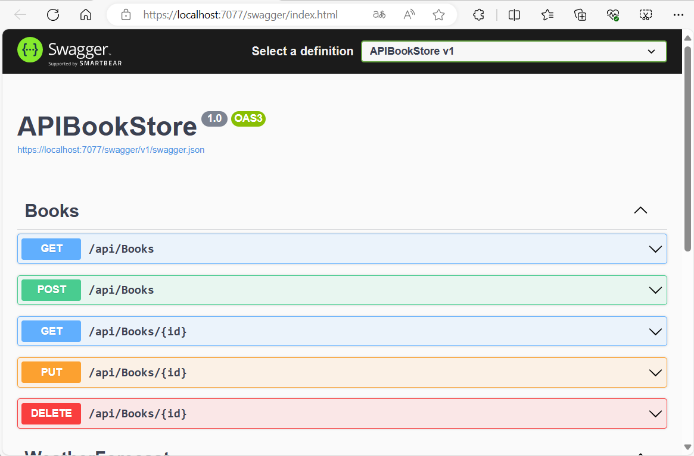
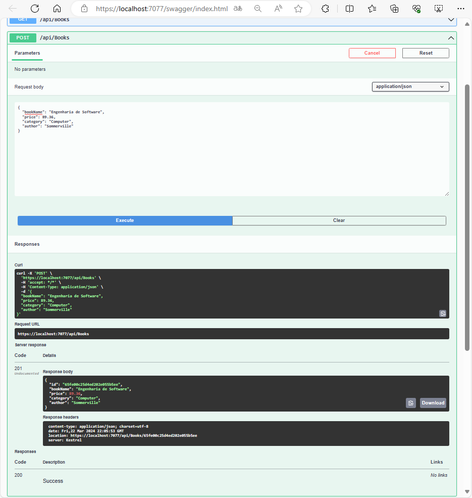
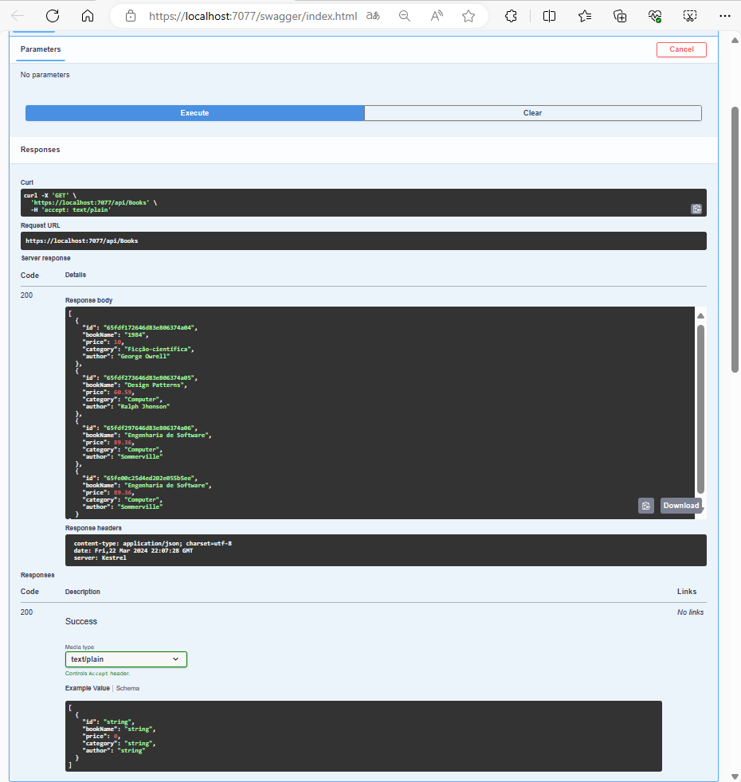

# Sumario

1. [Install MongoDB](#install-mongodb)
2. [Install Visual Studio 2022 end Open the Project](#install-visual-studio-2022-and-open-the-project)
3. [Install the Required NuGet Packages](#install-the-required-nuget-packages)
4. [Run the Project](#run-the-project)
5. [Notes and Additional Information](#notes-and-additional-information)]

## [Install MongoDB](#sumario)]

1	. Download the mongodb from the official website and install it.
	- Select the `Complete` installation type. And don't check the box for start automatically.(We will start it manually)
	- Install it in default folder i.e. `C:\Program Files\MongoDB\Server\7\`
2. Add the `bin` folder path to the environment variable.
	- After installation, go to the `bin` folder of the mongodb installation directory. i.e. `C:\Program Files\MongoDB\Server\7\bin`
	- Copy the path of the `bin` folder.
	- Search for `Environment Variables` in the windows search bar.
	- Click on `Environment Variables`.
	- In the `User variables` section, click on `Path` and then click on `Edit`.
	- Click on `New` and paste the path of the `bin` folder.
	- Click on `OK` and then click on `OK` again.
3. Create a folder for the database.
	- Create a folder in the `C` drive with the name `data`.
	- Inside the `data` folder, create another folder with the name `db`.
	- The path of the `db` folder should be `C:\data\db`.
4. Start the mongodb server.
	- Open the command prompt.
	- Type `mongod` and press enter.
	- If you see the message `waiting for connections on port 27017`, then the server is running successfully.

## [Install Visual Studio 2022 and Open the Project](#sumario)

1. Download the Visual Studio 2022 from the official website and install it							.
2. Download this repository and extract it.		
3. Open the extracted folder in Visual Studio 2022.
4. Open the `APIBookStore.sln` file.

## [Install the Required NuGet Packages](#sumario)

In progress... but basically you need to install the following packages:

1. Microsoft.EntityFrameworkCore
2. Microsoft.EntityFrameworkCore.Design
3. Microsoft.EntityFrameworkCore.SqlServer

## Run the Project

1. Press `Ctrl + F5` to run the project.											
2. If browser doesn't open automatically, then open the browser and try go to `https://localhost:7077/swagger/index.html` or `https://localhost:5001/swagger/index.html` to see the API documentation.



3. Try `POST` 
	- Clicl in `POST/api/Books` and then click on `Try it out` button.
	- Delete the line with the `id` and change de others values like this:
```json
{ 
  "bookName": "Design Patterns",
  "price": 60.59,
  "category": "Computer",
  "author": "Ralph Jhonson"
}
```

- Click on `Execute` button.
	

4. Try `GET`
	- Click in `GET/api/Books` and then click on `Try it out` button.
	- Click on `Execute` button.
	


## [Notes and Additional Information](#sumario)

__PS: if you have any questions, then please ask in the comments section.__

- Note: I have  used `API Web ASP.NET Core` template for this project. 
If you are using a different template, then you may see some errors.<BR>
In that case, you can create a new project using the `API Web ASP.NET Core` template and then copy the files from this project to the new project.`
- Note¹: If you see any error related to the nuget packages, then right-click on the solution and click on `Restore NuGet Packages`.
- Note²: If you see any error related to the SDK version, then download the required SDK version from the official website and install it.
- Note³: If you see any error related to the project, then right-click on the project and click on `Reload Project`.


---
[Click here to see the video tutorial to install MongoDb](https://www.youtube.com/watch?v=1uFY60CESlM)]